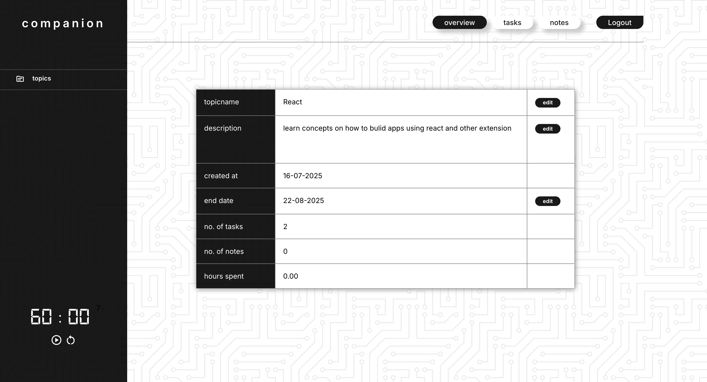

# COMPANION APP

## About 

**Companion** is a productivity web app built using React. It is designed to support learners by combining note-taking, task tracking, and timers with structured ways to connect concepts they study.

## Features

- User authentication
- Create topics and set deadlines
- Create task lists for each topic
- Create notes for each topic and link them to other notes for conceptual connections
- Timers with music to keep track of time spent on each topic
- Responsive design
- MongoDB integration for user data

## Screenshot

;
;
;

## Tech stack

### frontend

- React.js
- React Router DOM

### Backend

 - Express.js
           
### Database

- MongoDB Atlas

### Others

- Passport.js
- Mongoose
- Axios

## Setup

 ### Prerequsties

  - Node.js

  - npm or yarn

  - mongoDB Atlas

### Installation

1. **Clone the frontend repository**

git clone https://github.com/J05hua-mm/reactProject_companion.git
cd reactProject_companion
npm install
npm start
Clone the backend repository

2. **Clone the backend repository**

git clone https://github.com/J05hua-mm/backend_companion.git
cd backend_companion
npm install
node server.js

## Environment variable

In the frontend, create a .env file with:

- REACT_APP_API_URL = "your_backend_api_url_here"

This defines the backend route for your project since the frontend and backend are in separate repositories.

## Future Improvements

- Loading spinners for user feedback

- Dashboard for quick overviews

- Improved UI/UX with polished styles and themes

